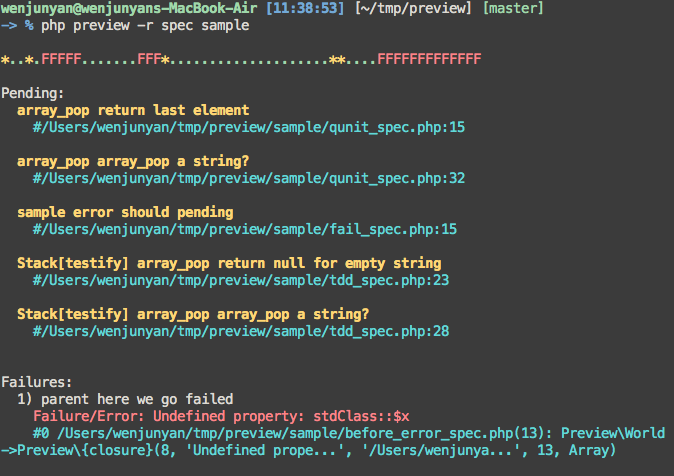
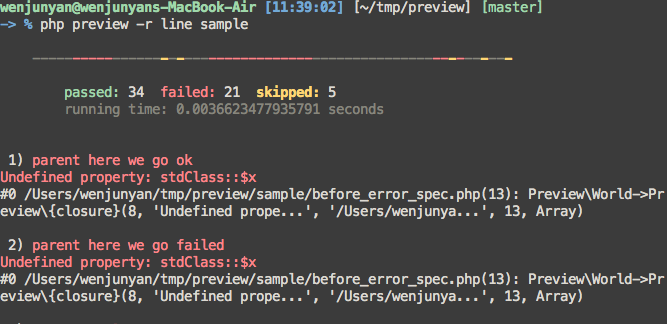
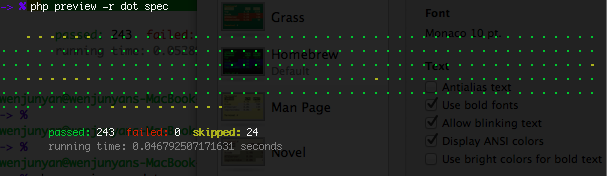
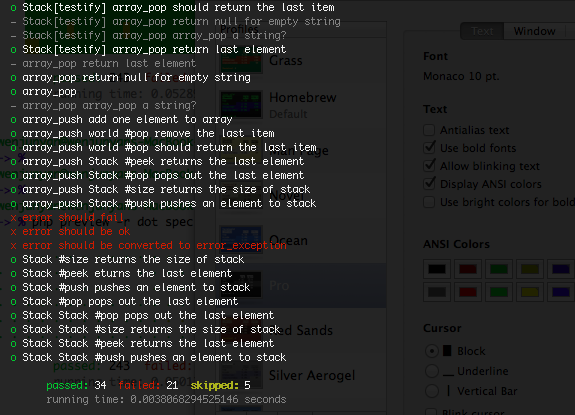
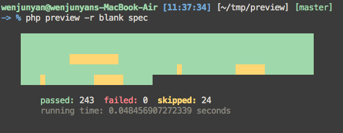

# Intro

## Config

`preview.config.php` in current dir will be autoloaded, if you do not
specify a config file by (-c, --config file)

- [default config](./preview.config.php)

## Assertion

Preview do not provide any assertion statement. Which means you can use any
assertion lib you want, if it throws an exception.
Preview will catch any exception as failure or error object(you can specify
which kind of exception to be catched as failure in [config file](./preview.config.php)).
Other exceptions will be treated as error.

This is a simple assertion function.
```php
function ok($expr, $msg="") {
    if ($msg instanceof Closure) {
        $expr = $expr->__invoke();
    }

    if (!$expr) {
        throw new \Exception($msg);
    }
}
```

## Exception

Exception will be catched in `before_each`, `after_each`, `before` hooks.
Exceptions in `after` won't be handled.

## PHP error

Preview by default use `set_error_handler` to convert error to ErrorException,
and catch it as an test error(you can disable this feature by `--with-error`).
Notice here, PHP fatal error cannot be catched.

Preview do not `register_shutdown_function`. So if tests crash down,
Preview won't be able handle it.

## DSL syntax

- [bdd](./bdd)
  * [#describe & #it](./bdd/basic_spec.php)
  * [#before](./bdd/before_spec.php)
  * [#before_each](./bdd/before_each_spec.php)
  * [#after](./bdd/after_spec.php)
  * [#after_each](./bdd/after_each_spec.php)
  * [#let](./bdd/let_spec.php)
  * [#subject](./bdd/let_spec.php)
  * [#shared_example & #it_behaves_like](./bdd/shared_example_and_behave_spec.php)
  * [skip](./bdd/skip_spec.php)
  * [pending](./bdd/pending_spec.php)
  * [group](./bdd/group_spec.php)

- [tdd](./tdd)
  * [#suite](./tdd/basic_spec.php)
  * [#test](./tdd/basic_spec.php)
  * [#setup](./tdd/setup_spec.php)
  * [#teardown](./tdd/teardown_spec.php)
  * [#suite_setup](./tdd/suite_setup_spec.php)
  * [#suite_teardown](./tdd/suite_teardown_spec.php)
  * [skip](./tdd/skip_spec.php)
  * [pending](./tdd/pending_spec.php)
  * [group](./tdd/group_spec.php)

- [qunit](./qunit)
  * [#suite](./tdd/basic_spec.php)
  * [#test](./tdd/basic_spec.php)
  * [#setup](./tdd/setup_spec.php)
  * [#teardown](./tdd/teardown_spec.php)
  * [skip](./qunit/skip_spec.php)
  * [pending](./qunit/pending_spec.php)

- [export](./export)
  * [#export](./export/basic_spec.php)
  * ["before"](./export/before_spec.php)
  * ["after"](./export/after_spec.php)
  * ["before each"](./export/before_each_spec.php)
  * ["after each"](./export/after_each_spec.php)

- [testify](./testify)
  * [Suite](./testify/basic_spec.php)
  * [#test](./testify/basic_spec.php)
  * [#add_child](./testify/basic_spec.php)
  * [#load](./testify/basic_spec.php)
  * [skip](./testify/skip_spec.php)
  * [pending](./testify/pending_spec.php)
  * [group](./testify/group_spec.php)


## Reporter

#### spec


#### line


#### dot


#### dropdown


#### blank



## Command Line Options

```
-> % php preview --help

    Preview 1.0 - bdd test framework for php

Usage: preview [options] [operands]
Options:
-h, --help              Show this help message.
-r, --reporter <arg>    Set reporter.
-g, --group <arg>       Test group(s). use comma(,) to seperate groups.
-c, --config <arg>      Load config file. Default './preview.config.php'.
--order                 Test are run in order.
--no-this               Disable using $this as an implicit context. PHP 5.4 only.
--no-color              Disable color output.
--with-error            Disable converting error to exception.
--fail-fast             Exit program when first failure or error occurred.
--list-groups           List all the test groups.
--list-reporters        List available reporters.
```
