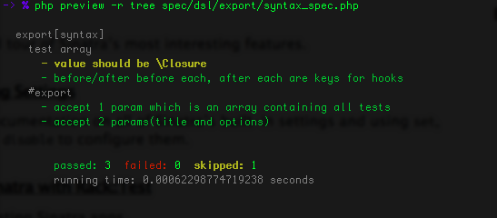

# Intro

## Install

Use composer to install preview.

### Local
composer.json

```php
{
    "require": {
        "v2e4lisp/preview": "*"
    }
}
```

```bash
composer install
```

show help message

```
php vendor/bin/preview -h
```

### Global

```bash
composer global require 'v2e4lisp/preview:*'
```

show help message

```
preview -h
```

## Config

`preview.config.php` in current dir will be autoloaded, if you do not
specify a config file (`-c, --config [file]`)

[default config](./preview.config.php)

## Assertion

Preview do not provide any assertion statement. Which means you can use any
assertion lib you want, if it throws an exception.
Preview will catch any exception as failure or error object(you can specify
which kind of exception to be catched as failure in [config file](./preview.config.php)).
Other exceptions will be treated as error.

This is a simple assertion function.
```php
function ok($expr, $msg="") {
    if ($msg instanceof Closure) {
        $expr = $expr->__invoke();
    }

    if (!$expr) {
        throw new \Exception($msg);
    }
}
```

## Exception

Exception will be catched in `before_each`, `before` hooks.
Exceptions in `after_each`, `after` won't be handled.

## PHP error

Preview by default use `set_error_handler` to convert error to ErrorException,
and catch it as an test error(you can disable this feature by `--with-error`).
Notice here, PHP fatal error cannot be catched.

Preview do not `register_shutdown_function`. So if tests crash down,
Preview won't be able handle it.

## Context or variable scope

Context is an object of `stdClass`.

Both test case(`it`) and test Suite(`describe`) has its own context.

Closure will be bound to its corresponding context(if there is one) and invoked.

The rules are:

* `before_each`/`after_each` hook and test case itself is invoked in current test case context.
* `before`/`after` hook is invoked in current test suite context.
* Test suite itself is invoked without any context

That is to say the following code is invalid.
```php
describe("sample suite", function () {
    $this->username = "me";
    it("username should be set", function () {
        ok($this->username);
    });
});
```
This is invalid because the body of the test suite is not invoked in any context.
So you do not have an `$this`. Regarding to the example above, instead of
assignments right in the test suite's body, you can write it in a before hook like this.

```php
describe("sample suite", function () {
    before(function () {
        $this->username = "me";
    });
    it("username should be set", function () {
        ok($this->username);
    });
});
```

## PHP 5.3

Since closure binding is not supported by PHP 5.3, you cannot use `$this` as an context object.
In this case, Preview will pass the context object to closure as an argument.
Said you cannot write test like this.
```php
describe("sample for PHP5.4", function () {
    before(function () {
        $this->username = "me";
    });
    it("username should be set", function () {
        ok($this->username);
    });
});
```
Write it this way instead.
```php
// Because test suite is not invoked in any context, no arg is needed here.
describe("sample for PHP5.3", function () {
    before(function ($self) {
        $self->username = "me";
    });
    it("username should be set", function ($self) {
        ok($self->username);
    });
});
```

Preview use the following code to invoke a closure.
```php
    /**
     * Invoke a closure with context(explicitly or implicitly)
     * if Preview::$config->use_implicit_context is set to true,
     * the closure will be bound to the context object.
     * Otherwise context will be passed to closure as an argument.
     *
     * @param function $fn
     * @param object context object (new stdClass)
     * @retrun mixed
     */
    protected function invoke_closure_with_context($fn, $context) {
        if (Preview::$config->use_implicit_context) {
            return $fn->bindTo($context, $context)->__invoke();
        } else {
            return $fn->__invoke($context);
        }
    }
```

## DSL syntax

- [bdd](./bdd)
  * [#describe](./bdd/basic_spec.php)
  * [#it](./bdd/basic_spec.php)
  * [#before](./bdd/before_spec.php)
  * [#before_each](./bdd/before_each_spec.php)
  * [#after](./bdd/after_spec.php)
  * [#after_each](./bdd/after_each_spec.php)
  * [#shared_example](./bdd/shared_example_and_behave_like_spec.php)
  * [#it_behaves_like](./bdd/shared_example_and_behave_like_spec.php)
  * [skip](./bdd/skip_spec.php)
  * [pending](./bdd/pending_spec.php)
  * [group](./bdd/group_spec.php)

- [tdd](./tdd)
  * [#suite](./tdd/basic_spec.php)
  * [#test](./tdd/basic_spec.php)
  * [#setup](./tdd/setup_spec.php)
  * [#teardown](./tdd/teardown_spec.php)
  * [#suite_setup](./tdd/suite_setup_spec.php)
  * [#suite_teardown](./tdd/suite_teardown_spec.php)
  * [skip](./tdd/skip_spec.php)
  * [pending](./tdd/pending_spec.php)
  * [group](./tdd/group_spec.php)

- [qunit](./qunit)
  * [#suite](./qunit/basic_spec.php)
  * [#test](./qunit/basic_spec.php)
  * [#setup](./qunit/setup_spec.php)
  * [#teardown](./qunit/teardown_spec.php)
  * [skip](./qunit/skip_spec.php)
  * [pending](./qunit/pending_spec.php)

- [export](./export)
  * [#export](./export/basic_spec.php)
  * ["before"](./export/before_spec.php)
  * ["after"](./export/after_spec.php)
  * ["before each"](./export/before_each_spec.php)
  * ["after each"](./export/after_each_spec.php)

- [testify](./testify)
  * [Suite](./testify/basic_spec.php)
  * [#test](./testify/basic_spec.php)
  * [#add_child](./testify/basic_spec.php)
  * [#load](./testify/basic_spec.php)
  * [skip](./testify/skip_spec.php)
  * [pending](./testify/pending_spec.php)
  * [group](./testify/group_spec.php)


## Reporter

#### spec


#### line


#### dot


#### dropdown


#### blank


#### tree



## Command Line Options

```
-> % php preview --help

    Preview 1.0 - bdd test framework for php

Usage: preview [options] [operands]
Options:
-h, --help              Show this help message.
-r, --reporter <arg>    Set reporter.
-g, --group <arg>       Test group(s). use comma(,) to seperate groups.
-c, --config <arg>      Load config file. Default './preview.config.php'.
-b, --backtrace         Print out full backtrace.
--order                 Test are run in order.
--no-this               Disable using $this as an implicit context. PHP 5.4 only.
--no-color              Disable color output.
--with-error            Disable converting error to exception.
--fail-fast             Exit program when first failure or error occurred.
--list-groups           List all the test groups.
--list-reporters        List available reporters.
```

## Related projects
- [mocha.js](http://visionmedia.github.io/mocha/) a bdd test framework for js.
- [Rspec](https://github.com/rspec) spec for ruby.
- [Pho](https://github.com/danielstjules/pho/) Another BDD test framework for php.
- [Testify](https://github.com/marco-fiset/Testify.php) a simple test framework for php.
- [QUnit](http://qunitjs.com/) simple test for js.

## License

The MIT License
